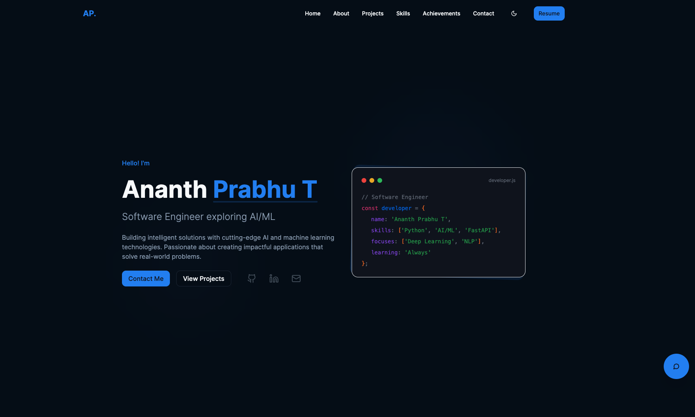

# 🚀 Ananth Prabhu T – Software Engineer Portfolio

[](https://ananthprabhu.dev)
[](https://github.com/AnanthPrabhuT/portfolio)


[](LICENSE)

---



## ✨ Overview

Welcome to the personal portfolio of **Ananth Prabhu T**, a passionate Software Engineering student at **The National Institute of Engineering, Mysuru** with a strong focus on **AI/ML and full-stack development**. With hands-on experience at **Apollo Global Management** and **Avanti Fellows**, I bring expertise in building intelligent applications using cutting-edge AI technologies. This portfolio showcases my journey, skills, projects, and achievements — built with a modern tech stack and polished UI/UX.

---

## 🎯 Features

- 📌 **Dynamic Content Sections** – About, Skills, Projects, Achievements, and Contact.
- 💡 **Responsive UI** – Optimized across mobile, tablet, and desktop screens.
- 🎨 **Theme Support** – Toggle between Light, Dark, and Purple themes.
- ✨ **Smooth Animations** – Powered by Framer Motion.
- ⚡ **Performance Focused** – Lazy loading with `react-lazy-load-image-component`.
- 📬 **Functional Contact Form** – Integrated with Web3Forms API.
- 🤖 **AI Chatbot** – Powered by Google Gemini 2.0 Flash to answer questions about skills, projects, and experience.
- 🎨 **Color-Coded Achievements** – Winners, Runners-up, and Finalists displayed with distinct colors.
- 📊 **Skill Icons** – Each skill comes with an emoji icon for visual appeal.
- 📝 **Expandable Experience** – Detailed work experience view with popup dialog.

---

## 🛠️ Tech Stack

| Category        | Tech Used                                  |
| --------------- | ------------------------------------------ |
| Frontend        | React (TypeScript), Vite                   |
| Styling         | Tailwind CSS, Custom & Radix UI Components |
| State & Routing | React Query, React Router DOM              |
| Animations      | Framer Motion                              |
| Form Handling   | Web3Forms API                              |
| Linting/Format  | ESLint, Prettier                           |

---

## 📁 Project Structure

```
src/
├── components/       # Reusable UI components
├── pages/            # Page views (e.g., Home, 404)
├── hooks/            # Custom React hooks
├── data/             # Static config/data (e.g., skills, links)
├── styles/           # Tailwind CSS config
├── App.tsx           # Root component
├── main.tsx          # App entry point
└── index.css         # Global styles
```

---

## ⚙️ Getting Started

> Run this project locally in a few simple steps:

### 🔧 Prerequisites

- Node.js v16+
- npm or yarn

### 🚀 Installation & Development

```bash
# Clone the repository
git clone https://github.com/prabhuanantht/portfolio.git
cd portfolio

# Install dependencies
npm install

# Set up environment variables
# Create a .env file in the root directory with:
# VITE_GEMINI_API_KEY=your_gemini_api_key_here
# Get your API key from: https://makersuite.google.com/app/apikey

# Start development server
npm run dev
```

Visit: `http://localhost:5173` (default Vite port)

### 🏗️ Production Build

```bash
npm run build      # Builds the project
npm run preview    # Serves the production build locally
```

### 🧹 Code Quality

```bash
npm run lint       # Lints your code with ESLint
```

---

## 🌍 Deployment

You can deploy this project on any modern static hosting service like **Vercel**, **Netlify**, or **GitHub Pages**.

### Example: Vercel

```bash
vercel deploy --prod
```

---

## 🔑 Environment Setup

### Required API Keys

1. **Web3Forms API Key** (for contact form):
   - Go to [Web3Forms](https://web3forms.com/)
   - Enter your email: `prabhuanantht@gmail.com`
   - Get your access key
   - Update the access key in `src/components/ContactSection.tsx` (lines 31 and 167)
   - **Note:** Web3Forms access keys are safe to expose client-side (they're designed for public use). However, you can also use environment variables if preferred:
     ```
     VITE_WEB3FORMS_ACCESS_KEY=your_access_key
     ```
     Then reference it as `import.meta.env.VITE_WEB3FORMS_ACCESS_KEY` in the component.

2. **Google Gemini API Key** (for AI chatbot):
   - Visit [Google AI Studio](https://makersuite.google.com/app/apikey)
   - Create a new API key
   - Create a `.env` file in the root directory:
     ```
     VITE_GEMINI_API_KEY=your_gemini_api_key_here
     ```

---

## 📬 Contact Me

I'm open to collaborations, opportunities, or just a chat!

- 📧 [prabhuanantht@gmail.com](mailto:prabhuanantht@gmail.com)
- 💼 [LinkedIn](https://linkedin.com/in/prabhuanantht)
- 💻 [GitHub](https://github.com/prabhuanantht)

---

> © 2025 Ananth Prabhu T
